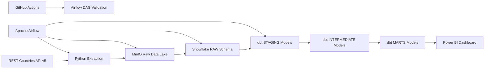

# TripLens Countries Explorer

[](https://github.com/Only1judhy/triplens-countries-explorer/actions/workflows/ci.yml)

TripLens Countries Explorer is an end-to-end data engineering and business intelligence project that collects global country data, stores raw API responses, transforms the data into analytics-ready models, and presents insights through an interactive Power BI dashboard.

## Project Overview

Travel platforms need consistent and accessible information about countries, currencies, languages, time zones, borders, populations, regions, and other destination attributes.

TripLens solves this by building an automated pipeline that:

1. Extracts country data from the REST Countries API.
2. Stores timestamped raw JSON files in MinIO.
3. Loads complete API batches into Snowflake.
4. Transforms the data using dbt.
5. Validates the models with automated data-quality tests.
6. Presents country insights in Power BI.
7. Orchestrates the complete workflow with Apache Airflow.
8. Validates Airflow DAGs automatically with GitHub Actions.

## Architecture



## Technology Stack

| Layer | Technology |
|---|---|
| Data source | REST Countries API v5 |
| Data extraction | Python |
| Raw object storage | MinIO |
| Data warehouse | Snowflake |
| Data transformation | dbt |
| Workflow orchestration | Apache Airflow and Astro CLI |
| Data visualisation | Power BI |
| Containerisation | Docker |
| Version control | Git and GitHub |
| Continuous integration | GitHub Actions |

## Pipeline Workflow

The Airflow DAG executes the following tasks in sequence:

```text
extract_countries
        ↓
upload_to_minio
        ↓
load_raw_to_snowflake
        ↓
run_dbt_models
        ↓
run_dbt_tests
```

The pipeline is scheduled to run every Monday at 6:00 a.m. using the `Europe/London` timezone.

## Data Extraction

The Python extraction process:

- Authenticates with the REST Countries v5 API.
- Retrieves paginated API results.
- Handles retries and request timeouts.
- Generates a unique pipeline run ID.
- Adds extraction timestamps and source metadata.
- Saves timestamped JSON files locally before uploading them to MinIO.

A complete extraction currently contains 254 country and territory records.

## Data Lake

MinIO provides an S3-compatible raw data layer.

Objects are stored using date-partitioned paths:

```text
rest-countries/
└── year=YYYY/
    └── month=MM/
        └── day=DD/
            └── countries_TIMESTAMP.json
```

This structure supports traceability, historical storage, and future incremental processing.

## Snowflake Structure

The Snowflake environment contains the following schemas:

| Schema | Purpose |
|---|---|
| `RAW` | Stores complete API responses as semi-structured VARIANT data |
| `STAGING` | Cleans and flattens raw country records |
| `INTERMEDIATE` | Applies reusable business transformations |
| `MARTS` | Provides analytics-ready dimensions, facts, and bridge tables |
| `AUDIT` | Records pipeline runs, statuses, object paths, and record counts |

## dbt Models

### Staging

- `stg_country_records`
- `stg_countries`
- `stg_country_currencies`
- `stg_country_languages`
- `stg_country_timezones`
- `stg_country_borders`

### Intermediate

- `int_countries`
- `int_country_currencies`
- `int_country_languages`
- `int_country_timezones`
- `int_country_borders`

### Dimensions

- `dim_country`
- `dim_currency`
- `dim_language`
- `dim_timezone`

### Bridge Tables

- `bridge_country_currency`
- `bridge_country_language`
- `bridge_country_timezone`
- `bridge_country_border`

### Fact Table

- `fact_country_profile`

## Data Quality

The project includes 33 successful dbt tests covering:

- Primary-key uniqueness
- Required-field completeness
- Referential integrity
- Valid relationships between facts, dimensions, and bridge tables
- Non-negative population and geographic values
- Country-count consistency between the fact and dimension models

Custom singular tests include:

- `assert_non_negative_country_values`
- `assert_fact_matches_country_count`

## Power BI Dashboard

The Power BI report contains five analytical pages.

### 1. Overview

- Total countries
- Total global population
- United Nations member countries
- Landlocked countries
- Countries by region
- UN membership distribution
- Region filtering

### 2. Country Explorer

- Individual country selection
- Capital
- Region and subregion
- Continent
- Population
- Calling code
- Language count
- Currency count
- Time-zone count
- Neighbouring-country count

### 3. Regional Analysis

- Population by region
- Country count by subregion
- Interactive regional filtering

### 4. Languages and Currencies

- Number of countries using each language
- Number of countries using each currency

### 5. Time Zones and Borders

- Countries by time zone
- Top countries by number of border relationships

The report file is available at:

```text
powerbi/TripLens_Countries_Explorer.pbix
```

## Repository Structure

```text
triplens-countries-explorer/
├── .github/
│   └── workflows/
│       └── ci.yml
├── dags/
│   └── triplens_countries_pipeline.py
├── dbt/
│   └── triplens_dbt/
│       ├── macros/
│       ├── models/
│       │   ├── staging/
│       │   ├── intermediate/
│       │   └── marts/
│       └── tests/
├── include/
│   └── triplens/
│       ├── extract_countries.py
│       ├── upload_to_minio.py
│       ├── load_raw_to_snowflake.py
│       └── test_snowflake_connection.py
├── powerbi/
│   └── TripLens_Countries_Explorer.pbix
├── tests/
├── .env.example
├── Dockerfile
├── packages.txt
├── requirements.txt
└── README.md
```

## Local Setup

### Prerequisites

Install:

- Python 3.12
- Git
- Docker Desktop
- Astro CLI
- Snowflake account
- Power BI Desktop
- dbt with the Snowflake adapter

### Clone the Repository

```bash
git clone https://github.com/Only1judhy/triplens-countries-explorer.git
cd triplens-countries-explorer
```

### Configure Environment Variables

Create a local `.env` file from the provided template:

```bash
cp .env.example .env
```

Add the required REST Countries, MinIO, and Snowflake credentials.

The real `.env` file is excluded from Git and must never be committed.

### Start MinIO

A local MinIO instance is expected to provide:

```text
API endpoint: localhost:9000
Console:      localhost:9001
Bucket:       triplens-raw
```

### Start Airflow

```bash
astro dev start
```

Astro will display the local Airflow UI address after startup.

### Validate the Airflow Project

```bash
astro dev parse
```

### Stop Airflow

```bash
astro dev stop
```

## Continuous Integration

The GitHub Actions workflow runs when:

- Code is pushed to `main`
- A pull request targets `main`
- The workflow is started manually

The workflow installs Astro CLI and runs:

```bash
astro dev parse
```

This confirms that the Airflow DAG imports and parses successfully before changes are accepted.

## Security

- Credentials are stored in a local `.env` file.
- `.env` is excluded through `.gitignore`.
- `.env.example` contains placeholders only.
- Raw API files and generated dbt artifacts are not committed.
- Snowflake analyst access is provided through a dedicated read-only role.

## Key Outcomes

- Automated extraction of 254 country and territory records
- Date-partitioned raw storage in MinIO
- Audited Snowflake ingestion
- Multi-layer dbt transformation architecture
- Analytics-ready dimensional model
- 33 passing dbt data-quality tests
- Five-page interactive Power BI dashboard
- Weekly Airflow orchestration
- Successful GitHub Actions DAG validation

## Author

**Glory Ozioma Emenaha**

GitHub: [Only1judhy](https://github.com/Only1judhy)
